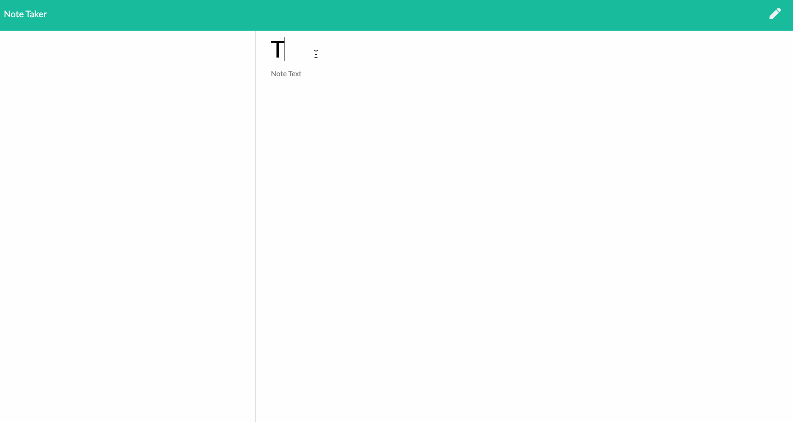
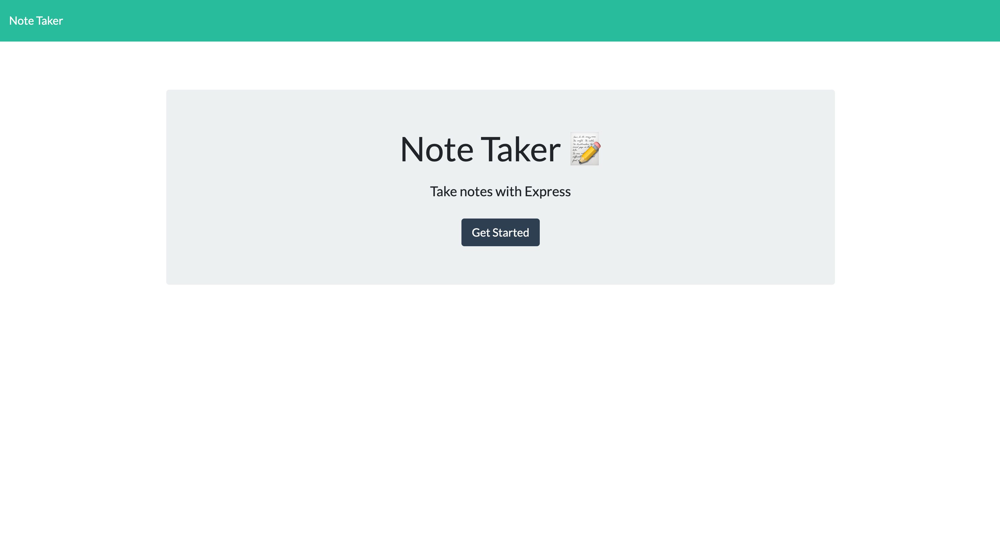
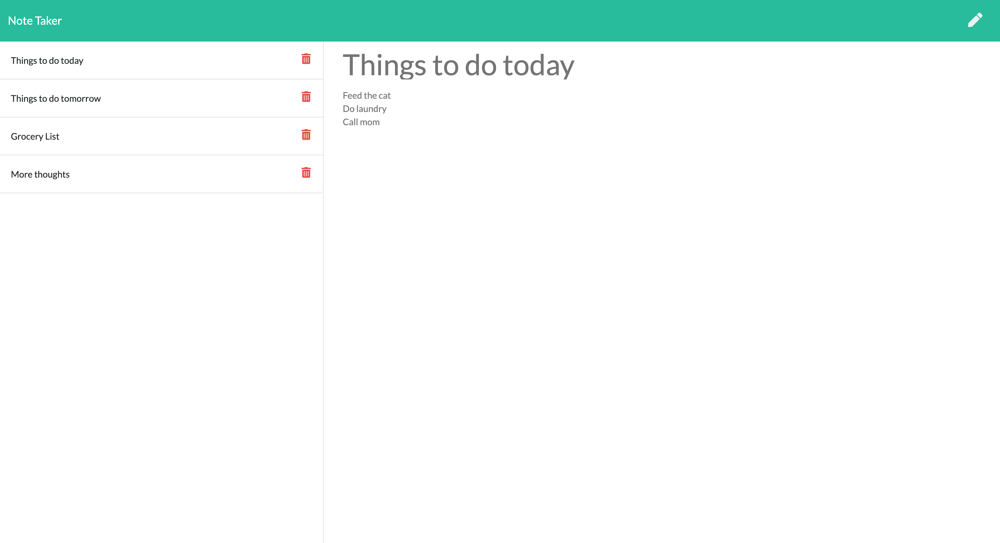

# Sticky Notes (NOTE-orious Note Taker)

In this project, I’ve created an application that takes notes! The user can write, save and delete the notes. It allows the user to keep track on any information, tasks, and/or lists they've written down, organize their thoughts, and type down anything that the user would like to store into these notes. They are able to save multiple notes and can view their previously saved notes at any time as well as delete at any time.

I was challenged in giving the IDs for each note. I did different approaches by modifying the index.js and set IDs into each li tag but ran into some bugs with viewing the note and having to click on the trash icon twice until the saved note deletes. So I decided to do a for loop and adding key value pairs after the user creates a new note but then stumbled upon other bugs such as, the first note not allowing me to view, repeated IDs when deleting a note and the same problem as the first encounter which was having to click the delete icon twice until it does. I tried fixing the delete icon by a different approach and everything stopped working completely, couldn't view notes or delete. I was able to solve it part by part, experimenting by changing the first note to id: 1 instead of 0 and realized it can't read 0 so I made them into strings. And I was able to have the IDs not repeat by just using the same for loop that I use at app.post to the app.delete. I didn't want to take the easy route by installing packages like uniqid, I wanted to try and solve it this way. I almost gave up and at the last attempt of my experimentation on the for loop, that's when I got things to work smoothly. I'm really happy being able to power through the challenge, especially since I kept breaking my code numerous times for this project just to find ways to work around it and solved it! Forgive my small wins and huge frustrations but as a new coder, it felt like an even bigger win.

## Table of Contents

* [Technologies Used](#technologies-used)
* [GIF of Project](#gif-of-project)
* [Image of Project](#image-of-project)
* [Code Snippet](#code-snippet)
* [Deployed Link](#deployed-link)
* [Authors](#authors)
* [License](#license)
* [Acknowledgments](#acknowledgments)

## Technologies Used

* [HTML](https://developer.mozilla.org/en-US/docs/Web/HTML)
* [Node.js](https://nodejs.org/en/)
* [Javascript](https://developer.mozilla.org/en-US/docs/Web/JavaScript)
* [jquery](https://jquery.com/)
* [AJAX](https://developer.mozilla.org/en-US/docs/Web/Guide/AJAX)
* [JSON](https://www.json.org/json-en.html)
* [API](https://developer.mozilla.org/en-US/docs/Learn/JavaScript/Client-side_web_APIs/Introduction)
* [ExpressJS](https://expressjs.com/)

## GIF of Project



## Images of Project

Attached below is a picture of the application at the main page and the notes page.




## Code Snippet
  
  In this code snippet, it deletes the notes and this is the where the saved notes on the left side are seen on the application with a trash can icon that allows the user to delete the specific note. How this is done is by setting an ID for each note. For my IDs, I'm using index numbers but in strings so that the first note can be viewed otherwise, if the values were set to numbers, the number 0 would not be read and therefore the note cannot be viewed and by deleting a specific note, I needed to make sure that the ID numbers do not repeat since it's set by the length of how many saved notes there are. In order to do that, I set the same for loop that allows the values for id to be rewritten and then updating the db.json where I store these saved notes.

```
// deletes the note containing the unique ID
app.delete("/api/notes/:id", function(req, res) {
    let index = req.params.id;

    // removes the note by the ID 
    for (let j = 0; j < savednotes.length; j++) {
        if (savednotes[j].id === index) {
            savednotes.splice(j.toString(), 1);
        };
    };

    // rewrites the key value pairs of the unique ID for each note
    for (let i = 0; i < savednotes.length; i++) {
        function adduniqueID(obj, key, id) {
            obj[key] = id.toString();
        };
        savednotes.map(function(note) {
            return adduniqueID(note, "id", i++);
        });
    };

    // updates the db.json when the note is deleted 
    fs.writeFile("./db/db.json", JSON.stringify(savednotes, null, 1), function(err) {
        if (err) throw err;
        res.status(200).json({ status: "ok" });
    });
});
```
## Deployed Link

Check out the application here: 

https://notetaker-expresslane.herokuapp.com/

## Authors

* Janessa Reeanne Fong

- [Link to Github](https://github.com/janessaref)
- [Link to LinkedIn](https://www.linkedin.com/in/janessafong)

## License

This project is licensed under the MIT License 

## Acknowledgments

* I'd like to acknowledge Andrew Knapp, my tutor who has helped me get unstuck with being able to write inside the array in the json file.
* I'd like to also acknowledge my instructors and TAs, Roger Lee, Kerwin Hy and Manuel Nunes that helped me towards accomplishing this project.
* I'd like to acknowledge information on how to create key value pairs in this stackoverflow post: https://stackoverflow.com/questions/28527712/how-to-add-key-value-pair-in-the-json-object-already-declared/28527898
